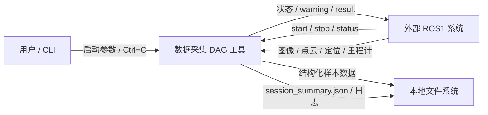
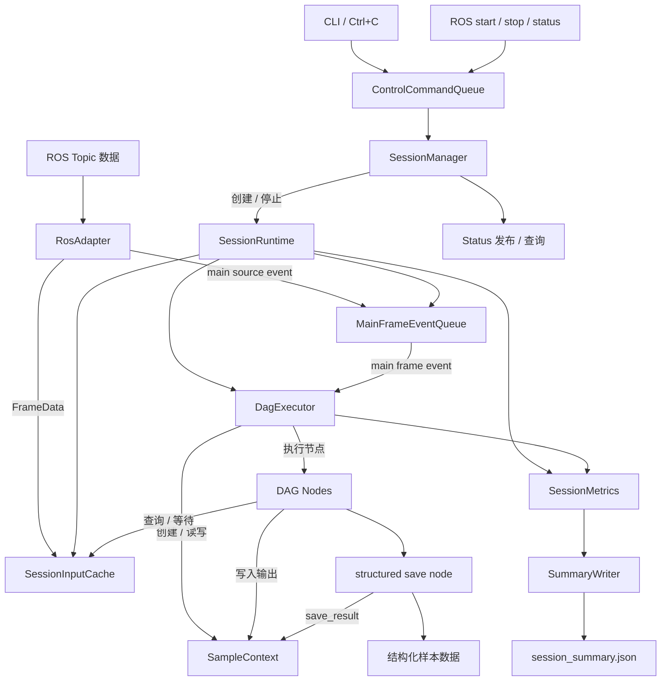
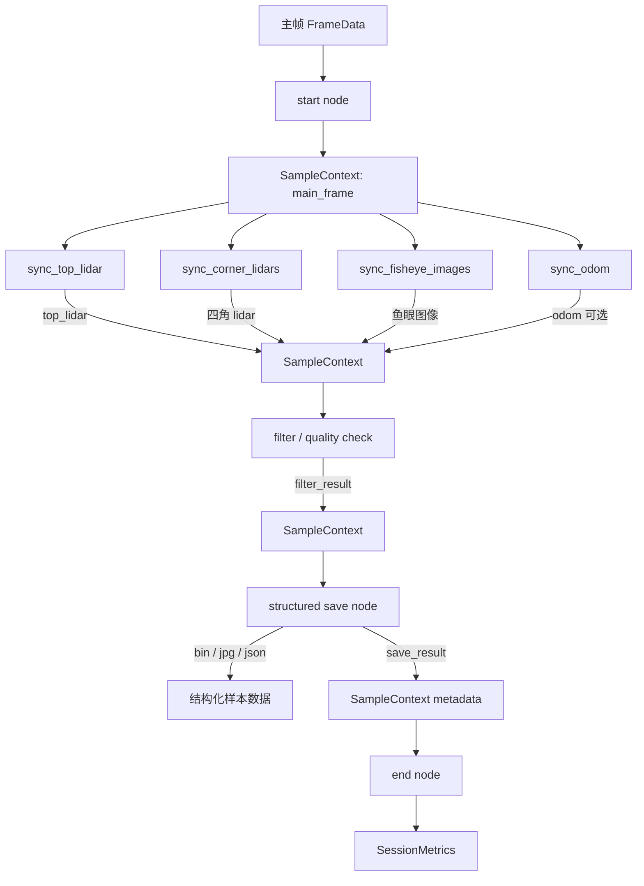
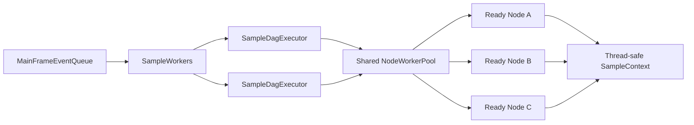

# 数据采集 DAG 工具架构设计文档

## 1. 设计目标

本工具是数据采集 DAG 工具，不是以 ROS node 为中心设计的业务节点。

第一版目标：

1. 支持 CLI 和 ROS1 指令启动、停止、查询采集 session。
2. 支持从 ROS1 topic 接入图像、点云、定位、里程计数据。
3. 支持 session 级缓存。
4. 支持主帧触发样本级 DAG。
5. 支持样本内 DAG 节点并发执行。
6. 支持同步节点从 session cache 查询或短暂等待其他传感器数据。
7. 支持通过 SampleContext 在节点之间传递数据引用。
8. 支持样本级结构化数据保存。
9. 支持状态统计与 session_summary.json。
10. 保证外部数据接收路径不被处理、推理或写盘阻塞。

第一版不实现：

1. rosbag_save 节点。
2. ROS2 通讯适配。
3. 多 session 并发运行。
4. 运行时修改 DAG。
5. 分布式调度。
6. 复杂规则引擎。
7. 完整任务管理平台。

---

## 2. 架构原则

1. ROS Adapter 与 DAG Core 解耦。
2. ROS callback 只做轻量接收、包装、缓存和主帧事件投递。
3. 耗时处理必须放在 DAG 节点中执行。
4. 缓存是 session 级，IDLE 状态不缓存数据。
5. 当前 session 不使用 start 前的数据。
6. DAG 内部使用工具内部数据对象，不直接依赖 ROS message 类型。
7. 一个主帧事件对应一个 SampleContext。
8. 样本数据可在 DAG 执行过程中逐步补齐。
9. SampleContext 只作为数据容器，不管理生命周期状态。
10. 保存目录和格式由具体保存节点决定。
11. drop、skip、fail 分开统计。

---

## 3. 总体架构

```text
CLI / ROS Control
        ↓
ControlCommandQueue
        ↓
SessionManager
        ↓
SessionRuntime
        ├── RosAdapter
        ├── SessionInputCache
        ├── MainFrameEventQueue
        ├── SampleWorkers
        ├── NodeWorkerPool
        ├── DagExecutor
        ├── DAG Nodes
        ├── SessionMetrics
        └── SummaryWriter
```

核心分层：

```text
外部接口层
  - CLI
  - ROS1 control
  - ROS1 topic subscriber
  - ROS1 status publisher / service

运行管理层
  - AppRuntime
  - SessionManager
  - SessionRuntime
  - ControlCommandQueue

数据接入层
  - RosAdapter
  - Frame wrapper
  - SessionInputCache

DAG 执行层
  - MainFrameEventQueue
  - SampleWorkers
  - DagExecutor
  - NodeWorkerPool
  - SampleContext
  - BaseNode / NodeFactory

保存与观测层
  - StructuredSaveNode
  - SessionMetrics
  - SummaryWriter
  - StatusManager
  - Logger
```

---

## 4. 数据流图 DFD

### 4.1 DFD-0：系统上下文图



### 4.2 DFD-1：系统级数据流图



### 4.3 DFD-2：样本级 DAG 数据流图



### 4.4 并发调度图



---

## 5. 核心模块划分

| 模块 | 职责 |
|---|---|
| AppRuntime | 程序入口、CLI 参数、配置加载、信号处理 |
| ConfigManager | YAML 解析、配置校验、pipeline 编译 |
| RosAdapter | ROS1 通讯、轻量消息包装、状态发布 |
| SessionManager | session 生命周期、start / stop / replace |
| SessionRuntime | 单个 session 的运行时资源集合 |
| SessionInputCache | session 级输入缓存 |
| MainFrameEventQueue | 主帧事件队列 |
| SampleWorkers | 消费主帧事件并执行样本级 DAG |
| NodeWorkerPool | 执行 ready nodes |
| DagExecutor | DAG ready queue 调度、节点结果处理 |
| BaseNode / NodeFactory | 节点接口与节点创建 |
| SampleContext | 单个样本的数据容器 |
| SessionMetrics | session 统计 |
| SummaryWriter | 写 session_summary.json |
| StructuredSaveNode | 样本级结构化保存 |

---

## 6. Session 生命周期

### 6.1 状态

工具运行状态：

```text
IDLE
RUNNING
```

最近 session 状态：

```text
STOPPED
COMPLETED
FAILED
```

### 6.2 start 流程

```text
1. ControlThread 收到 start(pipeline_name, params)。
2. 如果存在 active session，先执行 replace。
3. 校验 pipeline_name。
4. 创建 session_id。
5. 创建 session_root。
6. 创建 SessionRuntime。
7. 创建 SessionInputCache。
8. 创建 MainFrameEventQueue。
9. 创建 SampleWorkers。
10. 创建 NodeWorkerPool。
11. 创建 nodes。
12. 调用 node.setup()。
13. setup 失败：
    - teardown 已 setup 成功的节点。
    - 写 session_summary.json。
    - 最近 session 状态为 FAILED。
    - 不进入 RUNNING。
14. setup 全部成功：
    - 设置 active_session。
    - 工具状态为 RUNNING。
    - 允许 RosAdapter 写入 session cache。
    - 启动 sample workers。
```

session_root 创建失败时，当前 session FAILED，并通过日志和 status 暴露错误。

### 6.3 stop 流程

```text
1. 将 session 标记为 stopping。
2. 设置 session_cancel_event。
3. 停止写入 session cache。
4. 停止投递主帧事件。
5. 清空 MainFrameEventQueue。
6. 通知 sample workers 不再取新事件。
7. 通知正在执行的 sample 协作式取消。
8. 等待运行中的 sample / node 协作式退出。
9. 如果等待超过 stop_timeout_sec，记录 warning，并继续等待安全退出。
10. 所有 worker 安全退出后，调用 node.teardown()。
11. 写 session_summary.json。
12. 释放 SessionInputCache。
13. 释放 worker pool。
14. 清空 active_session。
15. 工具状态回到 IDLE。
```

stop_timeout_sec 是协作式取消等待告警阈值，不用于强杀线程，也不用于释放仍被运行节点使用的资源。

### 6.4 replace 流程

```text
1. 收到新 start 时，如果已有 active session，进入 replace。
2. 旧 session end_reason = replaced_by_new_start。
3. 旧 session end_status = STOPPED。
4. 完整清理旧 session。
5. 旧 session 清理完成后，再启动新 session。
```

### 6.5 结束状态规则

```text
外部 stop：STOPPED
Ctrl+C：STOPPED
被新 start 替换：STOPPED
运行时长达到配置值：COMPLETED
样本数量达到配置值：COMPLETED
采集流程正常结束：COMPLETED
setup 失败：FAILED
致命错误：FAILED
保存致命错误：FAILED
```

---

## 7. ROS1 输入与控制适配

### 7.1 控制指令

支持：

1. CLI 指定 pipeline 启动。
2. ROS start。
3. ROS stop。
4. ROS status。
5. Ctrl+C 停止当前 session。

所有控制指令进入 ControlCommandQueue，由 ControlThread 串行处理。

### 7.2 输入数据类型

第一版支持：

```text
sensor_msgs/Image
sensor_msgs/CompressedImage
sensor_msgs/PointCloud2
geometry_msgs/PoseStamped
nav_msgs/Odometry
```

### 7.3 ROS topic 配置

```yaml
ros:
  topics:
    front_wide_camera:
      topic: /camera/front_wide/image/compressed
      msg_type: sensor_msgs/CompressedImage
      role: image
      sensor_name: front_wide_camera

    top_lidar:
      topic: /lidar/top/points
      msg_type: sensor_msgs/PointCloud2
      role: pointcloud
      sensor_name: top_lidar

    odom:
      topic: /odom
      msg_type: nav_msgs/Odometry
      role: odometry
      sensor_name: odom
```

规则：

1. topic_key 必须唯一。
2. topic_key 用于 cache、main_source、sync node 配置。
3. ROS topic string 只在 RosAdapter 中使用。
4. DAG 节点不依赖 ROS topic string。

---

## 8. Session 级缓存设计

### 8.1 缓存作用域

1. IDLE 状态不缓存数据。
2. RUNNING 状态只缓存当前 session 数据。
3. 数据进入 session cache 必须满足：
   - receive_timestamp >= session_start_time。
   - source_timestamp 不存在，或 source_timestamp >= session_start_time。
4. stop / replace 后立即停止写入当前 session cache。
5. session 结束后释放 cache。

不满足时间边界的数据丢弃，drop_reason 为 before_session_start。

### 8.2 缓存配置

```yaml
cache:
  defaults_by_role:
    pointcloud:
      max_frames: 5
      max_age_sec: 1.0

    image:
      max_frames: 5
      max_age_sec: 1.0

    odometry:
      max_frames: 100
      max_age_sec: 5.0

    pose:
      max_frames: 100
      max_age_sec: 5.0

  topic_overrides:
    top_lidar:
      max_frames: 10
      max_age_sec: 1.0
```

规则：

1. defaults_by_role 提供默认值。
2. topic_overrides 覆盖具体 topic_key。
3. max_frames 始终表示单个 topic_key 的缓存帧数上限。
4. 内部按 topic_key 建独立 ring buffer。
5. query 使用 topic_key。

### 8.3 缓存 API

```text
append(topic_key, frame)
query_nearest(topic_key, timestamp, max_time_diff_ms)
query_latest_before(topic_key, timestamp, max_age_sec)
query_range(topic_key, start_time, end_time)
wait_nearest(topic_key, timestamp, max_time_diff_ms, timeout_ms)
```

第一版不做定位或里程计插值。

---

## 9. 主帧触发与样本级 DAG

pipeline 通过 main_source 指定主帧来源：

```yaml
pipelines:
  xtreme1_collect:
    main_source: front_wide_camera
```

主帧数据到达后：

```text
1. RosAdapter 写入 session cache。
2. 如果 topic_key == main_source，投递 MainFrameEvent。
3. SampleWorker 取出 MainFrameEvent。
4. 创建 SampleContext。
5. 执行样本级 DAG。
```

样本级 DAG 含义：

```text
一个主帧事件对应一个 SampleContext。
```

样本数据补齐流程：

```text
主帧到达
  → 创建 SampleContext
  → StartNode 写入 main_frame / main_timestamp
  → 同步节点查询或等待其他 topic
  → 处理节点写入结果
  → 筛选节点决定是否继续
  → 保存节点保存样本
  → EndNode 结束
```

---

## 10. DAG 执行器设计

### 10.1 Pipeline 编译

配置加载阶段编译 pipeline：

```text
nodes_by_id
predecessors
successors
start_node
end_node
```

校验：

1. node_id 唯一。
2. edges 引用节点存在。
3. DAG 无环。
4. 只有一个 start。
5. 只有一个 end。
6. 所有节点从 start 可达。
7. 所有节点可到达 end。

### 10.2 Ready Queue 调度

```text
1. start node 首先进入 ready queue。
2. 节点返回 OK 后，检查后继节点。
3. 后继节点的所有前置节点均 OK 后进入 ready queue。
4. ready nodes 提交到 NodeWorkerPool 并发执行。
5. end node 返回 OK 后，当前 sample DAG 正常结束。
```

### 10.3 NodeResult

```text
OK
SKIP_SAMPLE
FAIL_SAMPLE
FAIL_SESSION
CANCEL_SESSION
```

语义：

```text
OK：节点成功，继续执行后继节点。
SKIP_SAMPLE：当前样本跳过，session 继续。
FAIL_SAMPLE：当前样本失败，session 继续。
FAIL_SESSION：当前 session 失败。
CANCEL_SESSION：当前 session 或 sample 被取消。
```

### 10.4 非 OK 处理

任意节点返回非 OK：

```text
1. 当前 sample 不再调度新节点。
2. 设置 sample_cancel_event。
3. 通知当前 sample 中其他运行中节点协作式退出。
4. 等待运行中节点退出或记录等待超时 warning。
5. 根据 NodeResult 统计 sample 结果。
```

### 10.5 分支与汇合

规则：

```text
一个节点只有在所有前置节点都返回 OK 后才能执行。
```

保存节点必须通过 edges 显式依赖所有会影响保存决策的节点。

---

## 11. SampleContext 与内部数据对象

### 11.1 FrameMeta

```python
@dataclass(frozen=True)
class FrameMeta:
    session_id: str
    topic_key: str
    topic_name: str
    sensor_name: str
    role: str

    source_timestamp: float
    receive_timestamp: float
    frame_id: str | None = None
    seq: int | None = None

    msg_type: str | None = None
```

### 11.2 ImageFrame

```python
@dataclass(frozen=True)
class ImageFrame:
    meta: FrameMeta

    raw_msg_ref: Any
    encoding: str | None = None
    width: int | None = None
    height: int | None = None

    compressed: bool = False
    image_ref: Any | None = None
```

规则：

1. raw_msg_ref 保留原始 ROS message 引用。
2. RosAdapter 不做图像解码。
3. 图像解码由具体节点按需执行。

### 11.3 PointCloudFrame

```python
@dataclass(frozen=True)
class PointCloudFrame:
    meta: FrameMeta

    raw_msg_ref: Any
    point_step: int | None = None
    width: int | None = None
    height: int | None = None
    fields: list[str] | None = None

    points_ref: Any | None = None
```

规则：

1. raw_msg_ref 保留原始 PointCloud2 引用。
2. RosAdapter 不将 PointCloud2 转 numpy。
3. 点云解析由具体节点按需执行。

### 11.4 OdometryFrame

```python
@dataclass(frozen=True)
class OdometryFrame:
    meta: FrameMeta

    raw_msg_ref: Any

    position: tuple[float, float, float] | None = None
    orientation_xyzw: tuple[float, float, float, float] | None = None
    linear_velocity: tuple[float, float, float] | None = None
    angular_velocity: tuple[float, float, float] | None = None

    child_frame_id: str | None = None
```

### 11.5 PoseFrame

```python
@dataclass(frozen=True)
class PoseFrame:
    meta: FrameMeta

    raw_msg_ref: Any

    position: tuple[float, float, float] | None = None
    orientation_xyzw: tuple[float, float, float, float] | None = None
```

### 11.6 SampleContext

```python
@dataclass
class SampleContext:
    session_id: str
    sample_id: str
    pipeline_name: str

    main_source: str
    main_timestamp: float
    main_frame: Any

    data: dict
    metadata: dict

    session_cancel_event: threading.Event
    sample_cancel_event: threading.Event

    def write(self, key: str, value: Any, producer: str) -> None:
        ...

    def read(self, key: str, producer: str | None = None) -> Any:
        ...

    def has(self, key: str, producer: str | None = None) -> bool:
        ...

    def is_cancelled(self) -> bool:
        ...
```

SampleContext 不包含：

```text
status
生命周期状态
cache
output_root
logger
metrics
node registry
pipeline config
```

### 11.7 Context data 结构

```python
context.data = {
    "front_wide_camera": {
        "start": ImageFrame(...),
    },
    "top_lidar": {
        "sync_top_lidar": PointCloudFrame(...),
    },
    "filter_result": {
        "filter_by_score": FilterResult(...),
    },
}
```

规则：

1. key 只有一个 producer 时，可不指定 producer。
2. key 有多个 producer 时，必须指定 producer。
3. context 只保存引用，不复制大对象。
4. SampleContext 的锁只保护 data / metadata 容器结构，不保护 value 对象内部状态。
5. 节点写入 context 后，不应原地修改已写入的大对象。
6. producer 用于消除歧义，不鼓励滥用。

---

## 12. 节点接口设计

### 12.1 BaseNode

```python
class BaseNode:
    def __init__(
        self,
        node_id: str,
        node_type: str,
        inputs: dict,
        outputs: dict,
        config: dict,
        session: "SessionRuntime",
    ):
        self.node_id = node_id
        self.node_type = node_type
        self.inputs = inputs
        self.outputs = outputs
        self.config = config
        self.session = session

    def setup(self) -> None:
        pass

    def run(self, sample: "SampleContext") -> NodeResult:
        raise NotImplementedError

    def teardown(self) -> None:
        pass
```

规则：

1. BaseNode 构造时注入 SessionRuntime。
2. node.run() 只接收 SampleContext。
3. 节点通过 self.session 访问 session 级资源。
4. 不设计 NodeRuntimeContext。
5. SampleContext 不承载 session 级资源。

### 12.2 setup / run / teardown

setup：

```text
session 启动阶段执行。
用于资源检查、模型加载、writer 初始化、目录准备。
失败则当前 session FAILED。
```

run：

```text
每个 sample 执行一次。
返回 NodeResult。
可读写 SampleContext。
长耗时逻辑需要主动检查 sample.is_cancelled()。
```

teardown：

```text
session 清理阶段执行。
用于释放资源、关闭句柄、清理临时文件。
```

### 12.3 required / optional

框架负责：

1. 解析 inputs / outputs 映射。
2. 提供 context 读写。
3. 捕获节点异常。

节点负责：

1. 判断 required_inputs。
2. 判断 optional_inputs。
3. required input 缺失时返回 SKIP_SAMPLE。
4. optional input 缺失时继续执行，并记录 warning 或 metadata。

sync node 的 required 表示该同步节点匹配失败时是否跳过当前样本。

save node 的 required_inputs 表示保存节点生成有效样本所需的最小输入集合。

---

## 13. 保存节点与结构化数据保存

SaveNode 是保存能力扩展点。rosbag 保存未来可作为一种 SaveNode 类型接入。

第一版 MVP 只实现样本级结构化保存节点，不实现 rosbag_save 节点。

框架规则：

1. 框架为每个 session 创建 session_root。
2. session_summary.json 固定写入 session_root。
3. 保存节点在 session_root 下创建自身业务输出目录。
4. 保存目录和格式由保存节点决定。
5. 保存节点不负责写 session_summary.json。

保存节点职责：

1. 从 SampleContext 读取配置指定的输入。
2. 校验 required_inputs。
3. optional_inputs 缺失时继续执行。
4. 决定保存目录结构。
5. 保存 bin / jpg / json 等样本文件。
6. 写 sample metadata。
7. 通过 sample.metadata["save_result"] 上报保存结果。
8. 上报 save_outputs 到 session summary。

第一版保存语义：

1. 保存节点直接写正式输出目录。
2. 不保证样本级原子提交。
3. 不强制清理保存过程中残留的未完成文件。
4. samples_saved 只统计保存节点明确返回 OK 的样本。
5. 下游判断有效样本时，应依据保存节点 metadata、索引或 session_summary.json，而不是仅扫描文件是否存在。

保存成功后写入：

```python
sample.metadata["save_result"] = {
    "saved": True,
    "save_node": self.node_id,
    "output_path": "...",
}
```

保存节点示例：

```yaml
- node_id: save_xtreme1
  type: xtreme1_structured_save
  inputs:
    image_front: front_wide_camera
    top_lidar: top_lidar
    front_left_lidar: front_left_lidar
    front_right_lidar: front_right_lidar
    rear_left_lidar: rear_left_lidar
    rear_right_lidar: rear_right_lidar
    odom: odom
  config:
    dataset_name: collect_demo
    required_inputs:
      - image_front
      - top_lidar
    optional_inputs:
      - front_left_lidar
      - front_right_lidar
      - rear_left_lidar
      - rear_right_lidar
      - odom
```

---

## 14. 状态、统计与 session_summary.json

### 14.1 统计口径

```text
received_messages:
  ROS callback 收到并属于当前 RUNNING session 的消息数量。

cache_dropped_messages:
  因 session cache 满或数据过期被淘汰的消息数量。

main_frame_events:
  主帧消息成功投递到 MainFrameEventQueue 的数量。

main_frame_events_dropped:
  主帧队列满导致未进入 DAG 的主帧数量。

samples_started:
  SampleWorker 从 MainFrameEventQueue 取出主帧并创建 SampleContext 的数量。

samples_saved:
  保存节点成功写入有效样本，且 DagExecutor 到 end 后确认 save_result.saved=true。

samples_skipped:
  节点返回 SKIP_SAMPLE 的样本数量。

samples_failed:
  节点返回 FAIL_SAMPLE 或普通节点异常导致 fail_sample 的样本数量。

samples_canceled:
  session stop / replace / failed 过程中取消的样本数量。
```

### 14.2 drop / skip / fail

```text
drop：
  未进入 DAG 或缓存层丢弃。

skip：
  已进入 DAG，但因数据条件或筛选条件不满足而跳过。

fail：
  已进入 DAG，但处理异常。
```

分别统计：

```text
drop_reasons
skip_reasons
fail_reasons
```

### 14.3 session_summary.json

session_summary.json 由框架统一写入 session_root。

```json
{
  "session_id": "20260707_001_abcd",
  "pipeline_name": "xtreme1_collect",
  "start_time": "2026-07-07T10:00:00.000+09:00",
  "end_time": "2026-07-07T10:10:00.000+09:00",
  "end_status": "STOPPED",
  "end_reason": "external_stop",
  "config_path": "config.yaml",
  "session_root": "/data/output/20260707_001_abcd",
  "pipeline_params": {},

  "metrics": {
    "received_messages": {
      "front_wide_camera": 1200,
      "top_lidar": 1200
    },
    "cache_dropped_messages": {},
    "main_frame_events": 1200,
    "main_frame_events_dropped": 0,
    "samples_started": 1200,
    "samples_saved": 800,
    "samples_skipped": 390,
    "samples_failed": 10,
    "samples_canceled": 0,
    "warnings": 3,
    "errors": 10,
    "drop_reasons": {},
    "skip_reasons": {
      "required_input_missing:top_lidar": 200,
      "filter_rejected": 190
    },
    "fail_reasons": {
      "image_decode_failed": 10
    }
  },

  "save_outputs": [
    {
      "node_id": "save_xtreme1",
      "type": "xtreme1_structured_save",
      "output_path": "/data/output/20260707_001_abcd/xtreme1"
    }
  ],

  "last_error": null,
  "warnings": []
}
```

---

## 15. 配置设计

### 15.1 配置结构

```yaml
app:
  name: data_collect_dag

runtime:
  sample_workers: 1
  node_workers: 4
  main_frame_queue_size: 20
  stop_timeout_sec: 5.0

ros:
  node_name: data_collect_dag
  control:
    start_service: /data_collect/start
    stop_service: /data_collect/stop
    status_service: /data_collect/status
    status_topic: /data_collect/status
  topics:
    front_wide_camera:
      topic: /camera/front_wide/image/compressed
      msg_type: sensor_msgs/CompressedImage
      role: image
      sensor_name: front_wide_camera

    top_lidar:
      topic: /lidar/top/points
      msg_type: sensor_msgs/PointCloud2
      role: pointcloud
      sensor_name: top_lidar

cache:
  defaults_by_role:
    pointcloud:
      max_frames: 5
      max_age_sec: 1.0
    image:
      max_frames: 5
      max_age_sec: 1.0
  topic_overrides:
    top_lidar:
      max_frames: 10

output:
  root_dir: /data/collect_output
```

### 15.2 Pipeline 示例

```yaml
pipelines:
  xtreme1_collect:
    main_source: front_wide_camera

    end_condition:
      max_samples: null
      max_duration_sec: null

    nodes:
      - node_id: start
        type: start

      - node_id: sync_top_lidar
        type: time_sync
        inputs:
          reference_frame: main_frame
        outputs:
          matched_frame: top_lidar
        config:
          source: top_lidar
          strategy: nearest
          max_time_diff_ms: 50
          wait_timeout_ms: 100
          required: true

      - node_id: sync_corner_lidars
        type: multi_time_sync
        inputs:
          reference_frame: main_frame
        outputs:
          front_left_lidar: front_left_lidar
          front_right_lidar: front_right_lidar
          rear_left_lidar: rear_left_lidar
          rear_right_lidar: rear_right_lidar
        config:
          sources:
            - front_left_lidar
            - front_right_lidar
            - rear_left_lidar
            - rear_right_lidar
          strategy: nearest
          max_time_diff_ms: 50
          wait_timeout_ms: 100
          required: false

      - node_id: sync_odom
        type: time_sync
        inputs:
          reference_frame: main_frame
        outputs:
          matched_frame: odom
        config:
          source: odom
          strategy: latest_before
          max_time_diff_ms: 100
          wait_timeout_ms: 50
          required: false

      - node_id: save_xtreme1
        type: xtreme1_structured_save
        inputs:
          image_front: front_wide_camera
          top_lidar: top_lidar
          front_left_lidar: front_left_lidar
          front_right_lidar: front_right_lidar
          rear_left_lidar: rear_left_lidar
          rear_right_lidar: rear_right_lidar
          odom: odom
        config:
          dataset_name: collect_demo
          required_inputs:
            - image_front
            - top_lidar
          optional_inputs:
            - front_left_lidar
            - front_right_lidar
            - rear_left_lidar
            - rear_right_lidar
            - odom

      - node_id: end
        type: end

    edges:
      - [start, sync_top_lidar]
      - [start, sync_corner_lidars]
      - [start, sync_odom]
      - [sync_top_lidar, save_xtreme1]
      - [sync_corner_lidars, save_xtreme1]
      - [sync_odom, save_xtreme1]
      - [save_xtreme1, end]
```

规则：

1. ROS source 不作为普通 DAG node。
2. main_source 指定主帧触发源。
3. DAG 保留显式 start / end node。
4. edges 表达执行依赖和保存 gating 依赖。
5. inputs / outputs 使用 context key 映射。
6. 不引入表达式语言。

---

## 16. 异常处理与取消机制

### 16.1 默认异常策略

```text
required input 缺失：
  SKIP_SAMPLE

optional input 缺失：
  继续执行，记录 warning 或 metadata

普通处理节点异常：
  FAIL_SAMPLE

保存节点异常：
  FAIL_SESSION

node.setup 失败：
  session FAILED

stop / replace：
  CANCEL_SESSION
```

### 16.2 on_error

```yaml
- node_id: decode_image
  type: image_decode
  on_error: fail_sample
```

支持：

```text
ignore
skip_sample
fail_sample
fail_session
```

### 16.3 协作式取消

取消信号：

```text
session_cancel_event：
  整个 session 被 stop / replace / failed 时设置。

sample_cancel_event：
  当前 sample 因 SKIP_SAMPLE / FAIL_SAMPLE 等原因停止其他并发分支时设置。
```

节点应在以下位置检查取消：

1. 节点开始执行前。
2. 等待缓存数据时。
3. 模型推理前。
4. 大文件写入前。
5. 长循环内部。
6. 保存提交前。

---

## 17. 并发模型

线程模型：

```text
Main Thread
  - 程序启动
  - 配置加载
  - Ctrl+C 信号处理
  - 等待退出

ROS Callback Threads
  - 接收 ROS control
  - 接收 ROS topic
  - 写 session cache
  - 投递 main frame event

ControlThread
  - 串行处理 start / stop / replace / status

SampleWorkers
  - 消费 MainFrameEventQueue
  - 创建 SampleContext
  - 调用 DagExecutor 执行样本级 DAG

NodeWorkerPool
  - 执行 ready nodes
  - 当前 session 内所有 sample 共享
  - session 结束时释放
```

并发参数：

```yaml
runtime:
  sample_workers: 1
  node_workers: 4
  main_frame_queue_size: 20
  stop_timeout_sec: 5.0
```

默认：

```text
sample_workers = 1
node_workers = 4
```

第一版支持样本内并发，默认不启用样本间并发。

---

## 18. MVP 范围

MVP 包含：

1. 独立前台程序运行。
2. CLI 指定 pipeline 启动。
3. CLI 启动后监听 ROS start / stop / status。
4. ROS1 通讯。
5. Ctrl+C 停止当前 session。
6. 单 YAML 配置文件。
7. 启动时完整校验配置结构。
8. session_id 自动生成。
9. session 替换。
10. 工具运行状态 IDLE / RUNNING。
11. 最近 session 状态 STOPPED / COMPLETED / FAILED。
12. session 级缓存。
13. 按 topic_key 建立独立 ring buffer。
14. 主帧触发。
15. 样本级 DAG。
16. 样本内并发 DAG。
17. context 数据传递。
18. 多 producer context key 支持。
19. ImageFrame / PointCloudFrame / OdometryFrame / PoseFrame。
20. TimeSyncNode。
21. MultiTimeSyncNode。
22. xtreme1_structured_save 示例保存节点。
23. session_summary.json。
24. drop / skip / fail 原因统计。
25. 协作式取消。
26. stop / replace 清理流程。
27. 长期运行基本可观测性。

MVP 不包含：

1. rosbag_save 节点。
2. ROS2。
3. 多 session 并发。
4. 多 source / 多 sink。
5. 有环 DAG。
6. 运行时修改 DAG。
7. 分布式调度。
8. 跨机器任务编排。
9. 复杂规则引擎。
10. 完整任务管理平台。
11. 完整模型推理节点体系。
12. C++ 节点接入。

---

## 19. 后续扩展

后续扩展方向：

1. ROS2 Adapter。
2. rosbag_save 节点。
3. TensorRT / PyTorch 推理节点。
4. 图像处理节点。
5. 点云处理节点。
6. 运动补偿节点。
7. 更复杂的筛选规则。
8. C++ 节点接入。
9. 多 pipeline 热切换优化。
10. 更细粒度 cache lock。
11. 更丰富的状态发布。
12. 更完整的数据完整性校验。
13. 保存节点插件化管理。
14. 节点资源复用策略。
